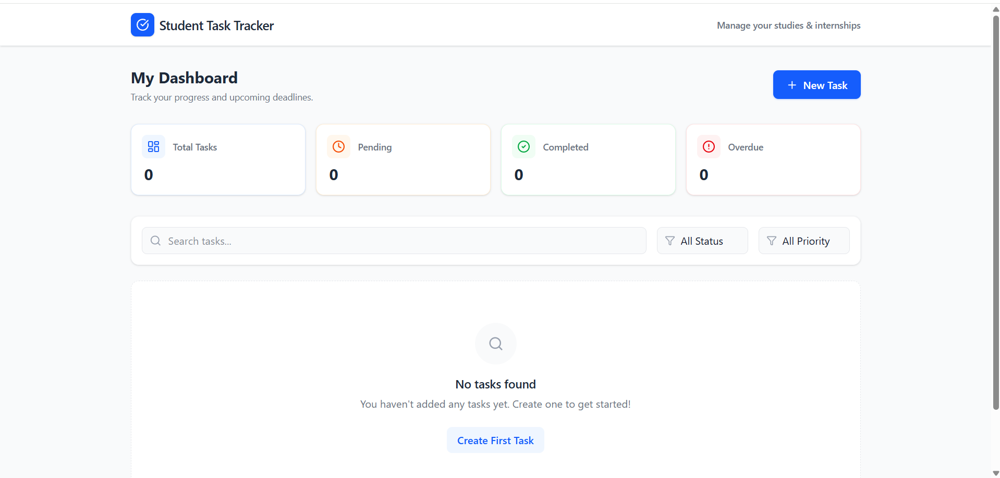
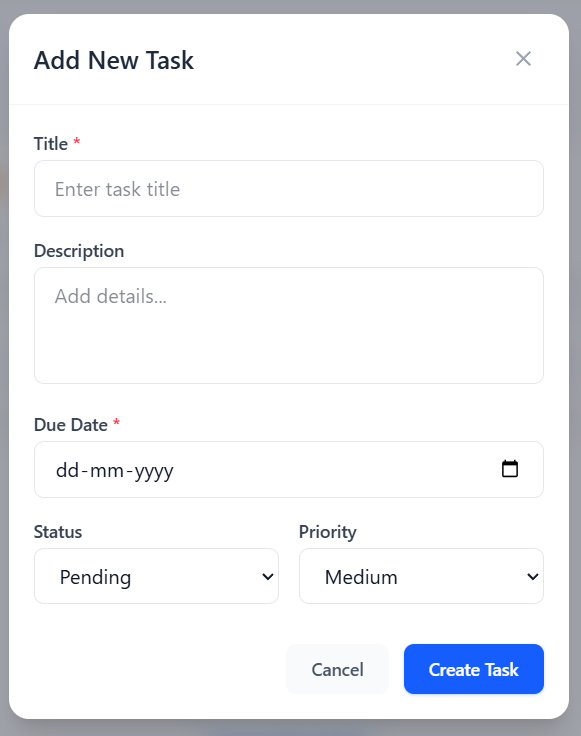
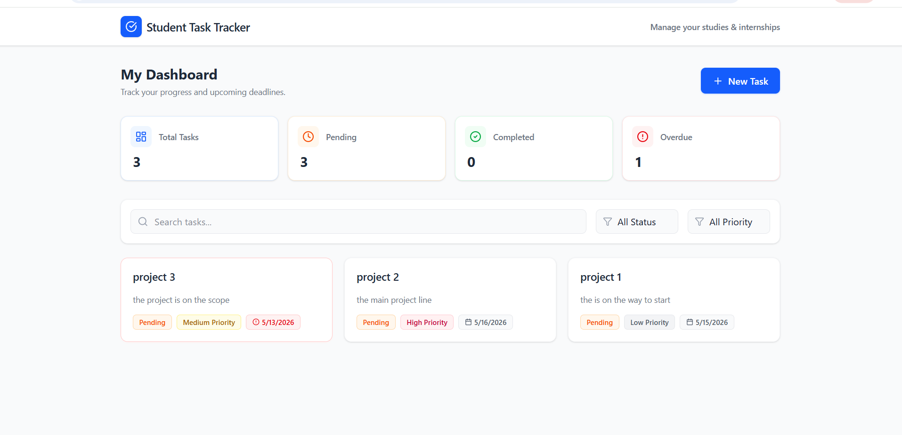
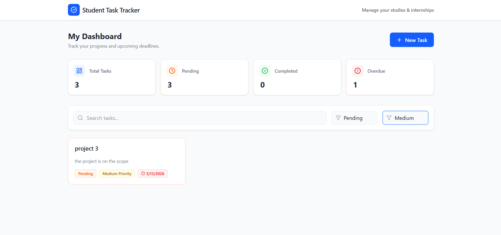
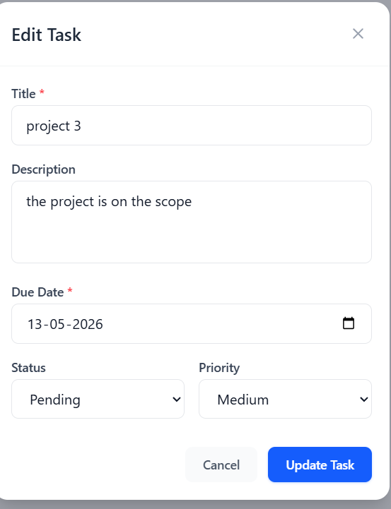

# Student Task Tracker

A professional, full-stack Task Management Application designed to help students organize their academic and internship responsibilities. Built with the MERN stack (MongoDB, Express, React, Node.js), this project features a clean, responsive interface and robust backend architecture.

---

## 🚀 Features

- **Task Management**: Create, Read, Update, and Delete (CRUD) tasks.
- **Dashboard Overview**: At-a-glance statistics showing Total, Pending, Completed, and Overdue tasks.
- **Smart Filtering & Search**: Filter tasks by Status or Priority, and search by title.
- **Automated Overdue Logic**: Automatically flags tasks as overdue if their deadline passes while pending.
- **Modern UI/UX**: Clean, professional design powered by Tailwind CSS.
- **Fluid Animations**: Smooth modal transitions and hover effects using Framer Motion.
- **Responsive Layout**: Seamlessly adapts to desktop, tablet, and mobile views.
- **Full-stack Validation**: Comprehensive error handling and data validation on both frontend and backend.

---

## 💻 Tech Stack

### Frontend
- **React.js (Vite)** - Fast, modern UI library.
- **Tailwind CSS** - Utility-first styling framework.
- **Framer Motion** - Production-ready animation library.
- **Axios** - Promise-based HTTP client for API requests.
- **Lucide React** - Clean and consistent iconography.

### Backend
- **Node.js & Express.js** - Robust server and routing infrastructure.
- **MongoDB Atlas** - Cloud-hosted NoSQL database.
- **Mongoose** - Elegant MongoDB object modeling.

---

## 📁 Folder Structure

```
student-task-tracker/
│
├── client/                 # Frontend React application (Vite)
│   ├── src/
│   │   ├── components/     # Reusable UI components (Navbar, TaskCard, TaskForm, TaskStats)
│   │   ├── pages/          # Main application views (Dashboard)
│   │   ├── services/       # API configuration (Axios instances)
│   │   ├── index.css       # Tailwind configuration and global styles
│   │   ├── App.jsx         # App routing and layout wrap
│   │   └── main.jsx        # React entry point
│   ├── package.json
│   └── tailwind.config.js
│
├── server/                 # Backend Node.js application
│   ├── controllers/        # Request handling logic (taskController.js)
│   ├── models/             # Database schemas (Task.js)
│   ├── routes/             # API endpoint definitions (taskRoutes.js)
│   ├── server.js           # Express server entry point
│   ├── .env.example        # Environment variable template
│   └── package.json
│
├── .gitignore              # Ignored files for git tracking
└── README.md               # Project documentation
```

---

## 🛠️ Installation & Local Setup

### Prerequisites
- [Node.js](https://nodejs.org/) installed
- A [MongoDB Atlas](https://www.mongodb.com/atlas) connection string (or a local MongoDB instance)

### 1. Clone the Repository
```bash
git clone <your-github-repo-url>
cd "Student task tracker"
```

### 2. Backend Setup
Navigate to the server directory and install dependencies:
```bash
cd server
npm install
```

Create a `.env` file based on `.env.example`:
```bash
cp .env.example .env
```
*(Open `.env` and paste your actual MongoDB connection string)*

Start the backend development server:
```bash
npm run dev
```
*(The server should output "Connected to MongoDB" and run on port 5000)*

### 3. Frontend Setup
Open a new terminal window, navigate to the client directory, and install dependencies:
```bash
cd client
npm install
```

Start the frontend development server:
```bash
npm run dev
```
*(Your app will be running at `http://localhost:5173`)*

---

## 🔐 Environment Variables

You must create a `.env` file in the `server` directory. Use the provided `server/.env.example` as a template.

| Variable | Description | Example |
| :--- | :--- | :--- |
| `PORT` | The port for the Express backend | `5000` |
| `MONGODB_URI` | Your MongoDB connection string | `mongodb+srv://<username>:<password>@cluster...` |

---

## 🌐 API Routes

| Method | Endpoint | Description | Request Body |
| :--- | :--- | :--- | :--- |
| `GET` | `/api/tasks` | Fetch all tasks | None |
| `POST` | `/api/tasks` | Create a new task | `{ title, description, dueDate, status, priority }` |
| `PUT` | `/api/tasks/:id`| Update an existing task | `{ title, description, dueDate, status, priority }` |
| `DELETE`| `/api/tasks/:id`| Delete a task | None |

---

## 📸 Screenshots

### Dashboard Overview


### Add/Edit Task Modal


### Task List


### Filtering and Search


### Edit Task


---

## 🔮 Future Improvements

If given more time, the following features would be implemented to enhance the application:
1. **User Authentication:** Implementing JWT-based login/signup for multiple users.
2. **Drag and Drop:** Kanban-style task progression.
3. **Email Reminders:** Automated node-cron jobs to send email alerts for overdue tasks.
4. **Pagination:** Implementing infinite scroll or pagination for the task list to optimize performance as data grows.

---

## 🤖 AI Usage Statement

This project was built to demonstrate full-stack proficiency. AI coding assistants (like GitHub Copilot/Gemini) were used strictly as pair-programming tools to accelerate boilerplate generation, optimize Tailwind CSS configurations, and refine documentation. All core architectural decisions, database schemas, API logic, and debugging were actively managed and directed by the developer.
